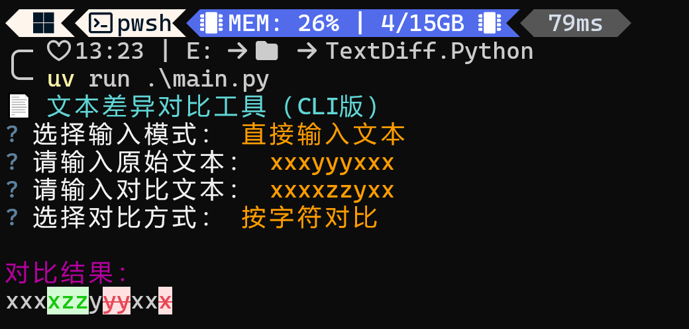

# 📄 文本差异对比工具（CLI版）

Designed by Rinkio-Lab

一个基于 [diff.js](https://github.com/kpdecker/jsdiff) + Python + [py_mini_racer](https://github.com/sqreen/PyMiniRacer) 的轻量命令行文本差异对比工具。  
支持多种对比模式，并可选择 **直接输入文本** 或 **使用 Notepad3 编辑临时文件** 进行对比。

## ✨ 功能特点

- 🔍 支持 **按词对比** / **按字符对比** / **按行对比**
- 💻 两种输入模式：
  - 直接在终端输入文本
  - 使用 **Notepad3** 编辑临时文件
- 🎨 使用 [rich](https://github.com/Textualize/rich) 高亮显示差异
- ⚡ 依赖 `diff.min.js`，运行速度快

## 📦 安装

### 1. 克隆项目

```bash
git clone https://github.com/Rinkio-Lab/Text-Diff.Python.git
cd Text-Diff.Python
```

### 2. 安装依赖（使用 uv）

```bash
uv sync
```

## 🚀 使用方法

运行：

```bash
uv run main.py
```

1. 选择输入模式

   - 直接输入文本
   - 用 Notepad3 编辑临时文件
2. 选择对比方式
3. 查看高亮的差异结果

## 🖼️ 效果示例

终端对比效果示例：



- **绿色**：新增内容
- **红色带删除线**：被移除的内容

## ⚙️ 依赖列表

- [py\_mini\_racer](https://github.com/sqreen/PyMiniRacer)
- [questionary](https://github.com/tmbo/questionary)
- [rich](https://github.com/Textualize/rich)

安装：

```bash
uv add py_mini_racer questionary rich
```

## 📜 许可证

本项目使用 MIT License。
